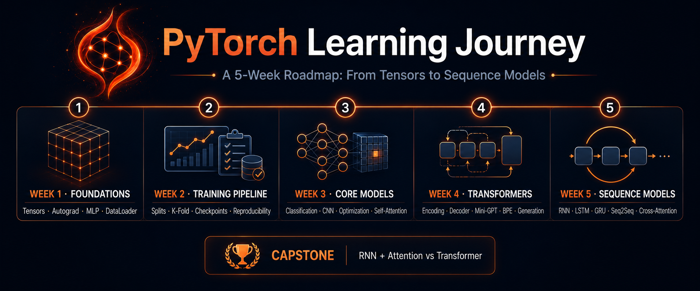

# pytorch-summer-2026



Self-paced PyTorch / deep-learning curriculum: tensors → autograd → training loops → CNNs → transformers → RNNs, building toward a PhD-level foundation in deep learning. Loosely follows *Dive into Deep Learning* (D2L), with examples leaning on finance/quant framing (OLS, factor models, portfolio returns, credit risk) where it fits naturally.

## Setup

Notebooks run against the `ptlearn` conda environment.

```bash
conda activate ptlearn
# or point Jupyter/VSCode at /opt/anaconda3/envs/ptlearn/bin/python
```

If the `ptlearn` Jupyter kernel isn't registered yet:

```bash
/opt/anaconda3/envs/ptlearn/bin/python -m ipykernel install --user --name ptlearn --display-name "Python (ptlearn)"
```

Core deps: `torch`, `numpy`, `matplotlib`, `pandas`.

## Structure

One subfolder per calendar week (`week{N}_basics/`); day numbering restarts at 1 each week.

```
week1_basics/    tensors, autograd, MLP classifier, Dataset/DataLoader,
                 custom .csv/.npy/.pt loading
week2_basics/    train/val/test split + stratified k-fold, checkpointing,
                 reproducibility (seed/logs/metrics)
week3_basics/    multi-class classification, dropout/weight decay, SGD vs Adam,
                 clean MLP/CNN design, CNN basics, self-attention, transformer
                 encoder block
week4_basics/    finishing the transformer arc: positional encoding, full
                 encoder stack, causal decoder block, mini-GPT assembly,
                 training on real text, sampling/generation, BPE tokenization
week5_basics/    RNN/LSTM/GRU foundations, vanishing/exploding gradients,
                 seq2seq (encoder-decoder), Bahdanau attention, capstone
                 comparing RNN+attention vs. a full transformer with real
                 cross-attention
```

Each week builds on the previous one's mechanics; later weeks assume earlier notebooks' classes/concepts without re-deriving them from scratch (though most notebooks redefine prior building blocks inline so they can run standalone).

## Conventions

- One notebook per day, `week{N}_day{D}_{topic}.ipynb`.
- Exercise notebooks are **scaffolds**: TODO stubs with conceptual hints and self-check cells, never filled-in solutions — the point is deriving/implementing things yourself, with the checks catching mistakes rather than the answer being handed over.
- The primary self-check technique for anything nontrivial: verify your implementation against PyTorch's own equivalent (`autograd` vs. hand-derived gradients, a custom `MultiHeadAttention` vs. `nn.MultiheadAttention`, a from-scratch `LSTM` vs. `nn.LSTM`, etc.) — usually via copying weights into the reference module so both sides compute on identical parameters.
- Given (non-exercise) parts — data generation, plotting utilities, weight-copying code for oracle checks — are written complete and working.
- Exercise notebooks end with a "Try yourself" section for further practice beyond the core exercise.
